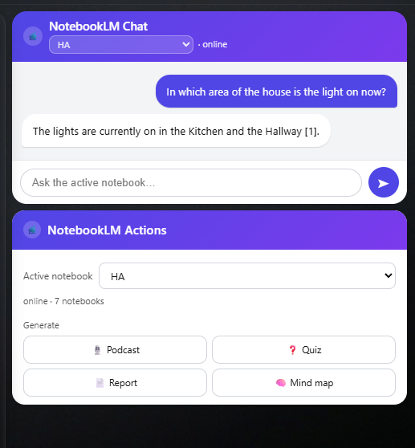
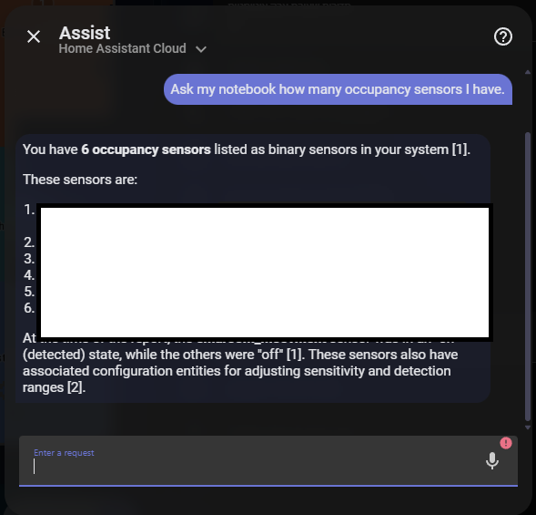

# Examples — dashboards & automations

Everything in the [`examples/`](../examples) folder is **optional**. The question
box, Ask button, last-answer sensor and voice intent are already built into the
integration — these are extras you copy in if you want them.

Screenshots referenced below live in [`docs/images/`](images/).

---

## Dashboard cards

The integration ships **two ready-made custom cards** — no `card-mod`, no YAML to
paste. Edit a dashboard → **Add card → Community cards**. Both render in a Shadow
DOM (so they look the same on any theme) and follow your Home Assistant language
(English / Hebrew).

### NotebookLM Chat

A messaging-app look: a branded header with the active-notebook picker and
connection status, chat bubbles (your question on the right, the answer on the
left — with a loading spinner while it thinks, and tap-to-expand on long
answers), and a send box.

### NotebookLM Actions

A compact control card: the active-notebook picker, connection status, and
one-tap generate buttons (podcast / quiz / report / mind map).

---

## Automations — `automations.yaml`

Paste these under **Settings → Automations** (YAML mode) and adjust the notify
target / time. Three starters:

1. **Artifact ready** — notify when a long generation (podcast, video, …)
   finishes, with a download link.
2. **Signed out** — alert when the Google session expires so you can re-auth.
3. **Morning briefing** — every day at a set time, ask the active notebook for a
   short briefing and announce it.

---

## Voice (Assist) — `custom_sentences/`

Sentence files that map spoken/typed phrases to the built-in `NotebookLMAsk`
intent. Copy them into your config and restart:

- `examples/custom_sentences/en/notebooklm.yaml` → `config/custom_sentences/en/notebooklm.yaml`
- `examples/custom_sentences/he/notebooklm.yaml` → `config/custom_sentences/he/notebooklm.yaml`

Then say or type to Assist: **"ask my notebook &lt;anything&gt;"** /
**"שאל את המחברת &lt;כל שאלה&gt;"**. It asks the active notebook and speaks the
answer.

